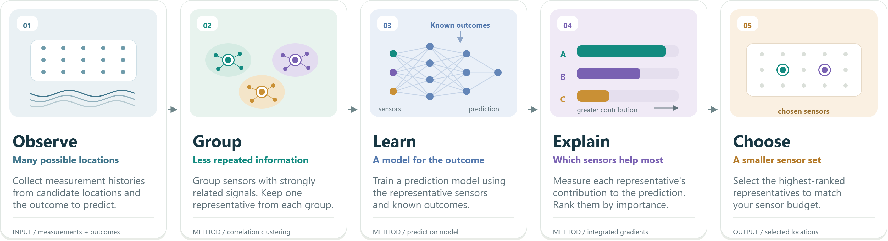

# CAAF

The Correlation-Assisted Attribution Framework (CAAF) ranks sensor locations for predictive ML applications by clustering correlated sensor histories, training a model to predict specified targets from cluster representatives, and ranking those representatives using integrated gradients. This repository accompanies *Data-driven Sensor Placement for Predictive Applications: A Correlation-Assisted Attribution Framework (CAAF)* https://doi.org/10.1038/s44488-026-00011-1.

<p align="center">
  
</p>

## Installation

Use Python 3.10 or newer. Download or clone this repository, keep its directory structure, and install CAAF with the notebook dependencies from the repository root.

```sh
python -m pip install ".[demo]"
```

For library-only use, install with `python -m pip install .`. The notebooks and data helpers require the source checkout and are not included in the installed package.

## Minimal airfoil example

Run this example from the repository root to load the included pressure and lift data and rank ten sensor locations.

```python
from pathlib import Path
import CAAF
from Demo.utils.airfoil_data_processing import load_airfoil_data

# Load and normalize the three airfoil cases using the demo preprocessing.
X, y, wall1, wall2 = load_airfoil_data(Path("Airfoil_lift_prediction"))

# Use a small model and reduced training and attribution for a first run.
indices, percentages = CAAF.rank_sensors(
    X, y, n_sensors=10, normalization="none",
    model={"hidden_sizes": (8, 8, 8)},
    training={"epochs": 2, "n_runs": 1},
    ig={"n_steps": 3, "max_samples": 512},
    return_percentages=True,
)
print("Sensor indices:", indices)
print("Attribution (%):", percentages)
```

This first run uses all 150,000 preprocessed rows and 376 candidate sensors, so loading and clustering still take time. Its reduced training and attribution settings demonstrate usage; use the [airfoil notebook](Demo/Airfoil_Lift_Prediction.ipynb) for the full configuration, results table, and sensor plot.

## Using `rank_sensors`

Provide finite numeric `X` with shape `(samples, sensors)` and `y` with shape `(samples,)` or `(samples, outputs)`, with matching sample counts.

Choose the return format needed for your application; each call runs the complete pipeline.

```python
# Return original sensor-column indices in decreasing importance.
indices = CAAF.rank_sensors(X, y, n_sensors=5)

# Include attribution percentages aligned with the selected indices.
indices, percentages = CAAF.rank_sensors(X, y, n_sensors=5, return_percentages=True)

# Include the full ranking, training histories, splits, and resolved settings.
details = CAAF.rank_sensors(X, y, n_sensors=5, return_details=True)
```

- Indices are zero-based columns of the original `X`. Constant sensor columns are excluded.
- `n_sensors=None` returns all cluster representatives. A requested count must not exceed the number of representatives.
- Percentages are relative to all representatives; the selected top sensors need not sum to 100%.
- Defaults use centered-max normalization, affinity propagation (`ap`), an MLP, one 150-epoch training run, and 50-step integrated gradients. `device="auto"` selects CUDA when available, otherwise CPU.

Pass only the settings you want to override.

| Argument | Common settings |
|---|---|
| `normalization` | `"centered_max"`, `"standard"`, `"minmax"`, `"centered_range"`, or `"none"`; use `{"x": ..., "y": ...}` to configure inputs and targets separately |
| `clustering` | Default `"ap"`; for example, `{"name": "kmeans", "n_clusters": 20}`; also supports `"spectral"` and `"agglomerative"` |
| `model` | `"mlp"`, `"lstm"`, `"tcn"`, or a custom PyTorch model class/factory |
| `sequence` | `{"length": 10, "horizon": 0}` for temporal histories; add `"groups": trajectory_ids` for concatenated independent trajectories |
| `training` | `{"epochs": 100, "n_runs": 5, "batch_size": 64, "lr": 1e-4}` |
| `ig` | `{"baseline": "mean", "n_steps": 50, "max_samples": 2000}`; `max_samples=None` evaluates all valid windows |
| `random_state`, `verbose` | Set the random seed (default `42`) and progress output (default `True`) |

See the [API reference](API.md) for all options, custom models and optimizers, temporal splitting, and diagnostic outputs.

## Run the demo notebooks

Open a notebook in `Demo/`, select the environment used for installation, and run its cells from top to bottom.

| Notebook | Task and data |
|---|---|
| [Airfoil lift prediction](Demo/Airfoil_Lift_Prediction.ipynb) | Rank pressure sensors for lift prediction using the included data in `Airfoil_lift_prediction/`. |
| [Structural health monitoring](Demo/SHM_Prediction.ipynb) | Rank 30 candidate beam positions for predicting three modal coordinates. Generates its own data. |
| [Wall-normal velocity prediction](Demo/Wall_Normal_Velocity_Prediction.ipynb) | Rank pressure-patch sensors using a TCN with ten-step histories. Requires the channel-flow MATLAB data described below. |

Each notebook includes preprocessing, ranking, a results table, and a sensor-location plot. Full runs train five models and can take substantial time on CPU. For a short run, skip the full ranking cell and uncomment and run the optional smoke-test cell immediately below it, then continue to the table and plot. This reduces training and attribution only; preprocessing and clustering still use the full data. Restart the kernel after editing CAAF source files.

For the velocity demo, obtain the [channel-flow data from Figshare](https://doi.org/10.6084/m9.figshare.31896294) and ensure `V_data.mat`, `P_w.mat`, `x_edge.mat`, `y_edge.mat`, and `z_edge.mat` are in `Wall-normal velocity prediction/`. `V_data.mat` is not included in this checkout. The loader expects MATLAB 7.3/HDF5 pressure and velocity files; the notebook does not download data automatically.

**Interpreting results:** normalization and clustering use all supplied data, and validation loss selects training checkpoints. In the airfoil demo, repeated samples and correlated time samples can occur in both training and validation. For an independent predictive evaluation, hold out cases or time blocks before preprocessing and sensor selection. The short-run settings are for checking execution, and the demos do not guarantee reproduction of historical rankings.

## License and contact

Code is distributed under the [MIT license](LICENSE). For data inquiries, contact sleung@caltech.edu or szechaileung@outlook.com.
